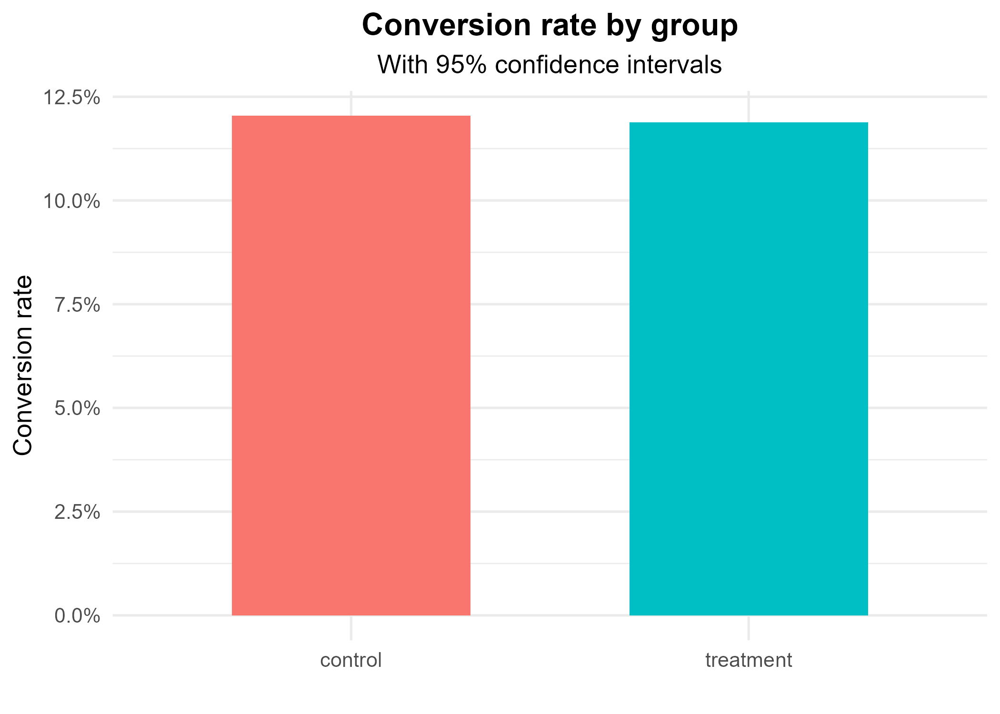
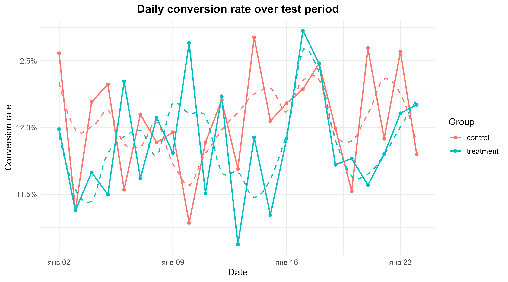

# A/B-тест: конверсия целевой страницы

## Краткое описание проекта

Проведен A/B-тест для сравнения коэффициентов конверсии старой и новой версий целевой страницы интернет-магазина.  На основе более 290 000 наблюдений оценена разница в коэффициентах конверсии между контрольной и экспериментальной группами, проверена статистическая значимость с помощью z-теста и визуализирована суточная динамика

---

## Бизнес-цель

**Цель:** понять, увеличивает ли новая версия целевой страницы конверсию (регистрации/покупки) по сравнению с текущей

**Гипотеза (H1):** новая страница приводит к **более высокой** конверсии, чем старая 
**Нулевая гипотеза (H0):** конверсия для обеих версий **не отличается**

**Критерий успеха:** статистически значимое увеличение конверсии для экспериментальной группы при уровне значимости 5%

---

## Набор данных

- **Источник:** набор данных Kaggle A/B-тестирования (целевая страница сервиса электронной коммерции)
- **Структура:**
  - `user_id` — уникальный пользователь;
  - `timestamp` — время просмотра страницы;
  - `group` — экспериментальная группа (`control` / `treatment`);
  - `landing_page` — фактическая страница (`old_page` / `new_page`);
  - `converted` — конверсия (1 — да, 0 — нет)

---

## Методы

1. **Очистка данных**
   - Строки с пропущенными значениями в ключевых полях (`group`, `landing_page`, `converted`) были удалены
   - Остались только правильные пары:
     - `control → old_page`
     - `treatment → new_page`
   - Для пользователей с несколькими Первое появление записывается.

2. **Статистический тест**
   - Z-тест различий в пропорциях.
   - Расчет z-статистики, p-значения и 95% доверительного интервала для разницы в конверсиях.

3. **Визуализация**
   - Гистограмма конверсий по группам с 95% ДИ
   - Линейный график ежедневных конверсий с точками и сглаженными трендами

---

## Основные выводы

### 1. Средняя конверсия для контрольной и экспериментальной групп практически идентична

- Конверсии для обеих версий составляют около **11,8–12,0%**
- Визуально между столбцами нет заметного разрыва, а 95% доверительные интервалы значительно пересекаются

### 2. Ежедневные тренды не показывают устойчивого преимущества экспериментальной группы

- В разные дни одна из групп немного превосходит другую, но **стабильного превосходства** новой страницы не наблюдается
- Сглаженные линии (пунктирные) для контрольной и экспериментальной групп практически идентичны на протяжении всего интервала

### 3. Результаты Z-теста

Из расчетов:

- \(z = -1,31\)
- \(p = 0,19\)
- Разница в конверсиях (экспериментальная группа − контрольная группа) близка к нулю, с 95% доверительным интервалом, включающим 0

**Интерпретация:** при уровне значимости 5% **нет статистически значимых доказательств** того, что новая версия целевой страницы конвертируется лучше или хуже текущей

---

## Интерпретация и влияние на бизнес

1. **Гипотеза о росте конверсии не подтверждается**  
   Эксперимент не показывает, что новая страница обеспечивает заметное улучшение ключевых показателей

2. **Эффект либо отсутствует, либо слишком мал.**  
   На основании текущих данных A/B-тест не выявляет разницы, достаточной для принятия уверенного бизнес-решения

3. **Риск ухудшения показателей не обнаружен**  
   Также нет статистически значимой отрицательной разницы — новая версия выглядит «не хуже», но и не лучше

---

## Рекомендации

### 1. Что делать с текущей страницей

- Если цель эксперимента **заключается конкретно в увеличении конверсии**, рационально:
  - **оставить контрольную версию** в качестве основной;
  - считать гипотезу «новый дизайн увеличивает конверсию» **отвергнутой**.
- Если новая страница важна по другим причинам (бренд, визуальная согласованность, требования к продукту), можно:
  - перейти на новую версию **с пониманием**, что на данный момент увеличения конверсии нет

### 2. Как улучшить дальнейшие эксперименты

1. **Уточните гипотезы**  
   Вместо одного большого изменения протестируйте конкретные элементы:
   - заголовок и подзаголовок;
   - формулировку призыва к действию;
   - длину формы и количество полей;
   - расположение блока доверия (отзывы, логотипы клиентов)

2. **Спланируйте тест (анализ мощности)**
Перед запуском следующего A/B-теста оцените
   - минимальный интересующий вас эффект (например, +1 п.п. конверсии);
   - необходимый объем трафика и продолжительность эксперимента

3. **Проверьте эффекты по сегментам**  
   Дополнительно изучите:
   - новых и возвращающихся пользователей;
   - мобильные устройства и настольные компьютеры;
   - источники трафика.  
   Иногда общий эффект равен «0», но в определенных сегментах новая страница работает лучше/хуже.

---

## Инструменты

- **Язык:** R
- **Пакеты:** `tidyverse`, `lubridate`, `ggplot2`, `scales`, `shiny`
- **Подход:** классический A/B-анализ (z-тест различий в пропорциях) + панель инструментов Shiny для интерактивного просмотра результатов

---

## Repository Structure

- `ab_test_landing`
   - `data`
      - `Sales_Data.csv` сырые данные
   - `results`
      - `segment_summary.csv` собранные данные по сегментам
      - визуализация
   - `ab_test_script.Rmd` код в R 
   - `ab_test_script.html` html-версия кода в R 
   - `README.md`
   - `README_RUS.md`

---

## Как воспроизвести
### 1. Добавьте репозиторий
git clone https://github.com/Wladislawe/ab-test-conversion

### 2. Установите пакеты R
install.packages(c("tidyverse", "shiny", "ggplot2", "scales"))

---

## 📧 Контакты
#### Владислав Овчаренко
##### количественный BI и опросный аналитик

[Профиль LinkedIn](https://www.linkedin.com/in/vlad-ovcharenko-9aa5013aa/?locale=en-US)
Email: vladgrinov890@gmail.com
Telegram: @vlad1s_love

